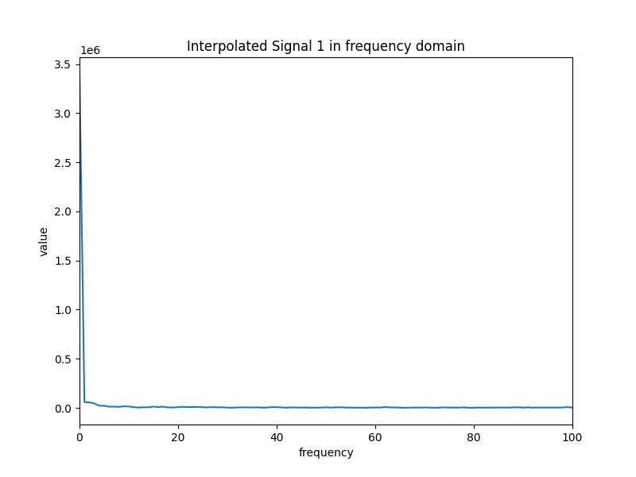
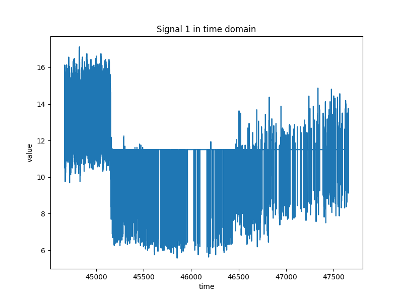

# Master Thesis
This is my master thesis (in progress).
## Title
> [!IMPORTANT] 
> Joint analysis of slow waves and pulse waveform of intracranial pressure
# Project Description
This Python project processes signals stored in a .pkl file, interpolates them to a specified sampling frequency, and then displays both the time-domain signal and its frequency spectrum. The project uses the pickle, pathlib, matplotlib, and numpy libraries.

## Requirements
To run this code, you need the following Python libraries:
- pickle
- matplotlib
- numpy

You can install the missing libraries using pip:

    pip install matplotlib numpy

## Usage Instructions
Make sure you have the file 2aHc688_ICP.pkl in the data directory.
Run the Python script:

    python main.py

## Script Description
<strong>1.  Loading Data:</strong>
The script loads data from the 2aHc688_ICP.pkl file using the pickle library.

<strong> 2. Signal Processing: </strong>
It retrieves signal data, sampling frequency, error flag, and start time.
Calculates the sampling period and signal end time.
Creates time arrays for the original and interpolated signals.
Interpolates the signal to the desired sampling frequency (100 Hz).
Performs a Fourier transform on the interpolated signal.

<strong> 3. Visualization: </strong> 
Plots the original time-domain signal.
Plots the interpolated time-domain signal.
Plots the magnitude of the Fourier transform of the interpolated signal in the frequency domain.

## Sample Results

### <strong> Time-Domain Signal</strong>

### <strong> Interpolated Time-Domain Signal </strong>

### <strong> Frequency Spectrum of the Interpolated Signal </strong>

